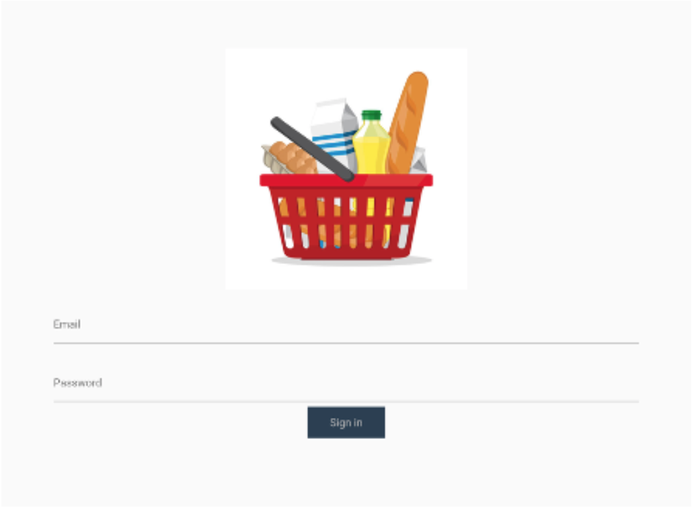
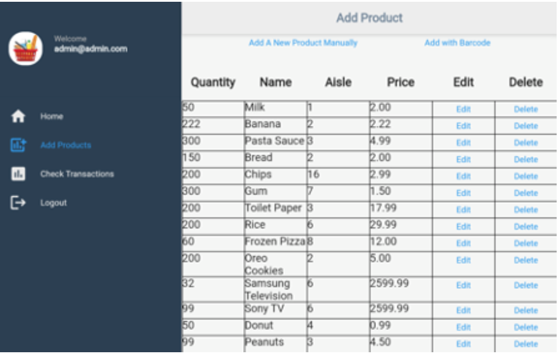
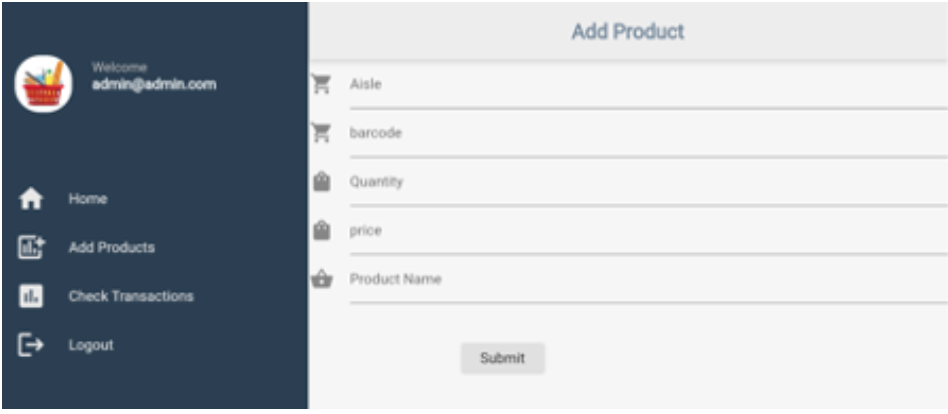
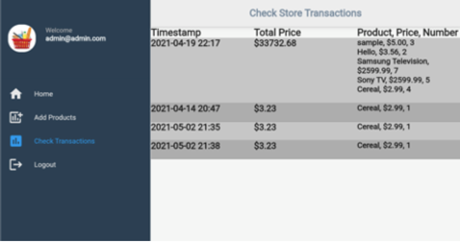

# Baket: A Contactless Shopping Experience
## Store Manager's Web Application

### To Run Code Instruction
* Install Firebase CLI
	* Follow <a href="https://firebase.google.com/docs/cli">Google's Official Guide</a>
	* Must have a GCP account
	* Configure credentials in ```/web/index.html```

* Install Flutter Framework
	* Follow <a href="https://flutter.dev/docs/get-started/install">Google's Official Instruction</a>
	* Clone this repository
	* Command ```flutter run```

### Project Features
* Manager authentication

* Store inventory management


* View the store’s transaction history

* Inventory-based alerting 
